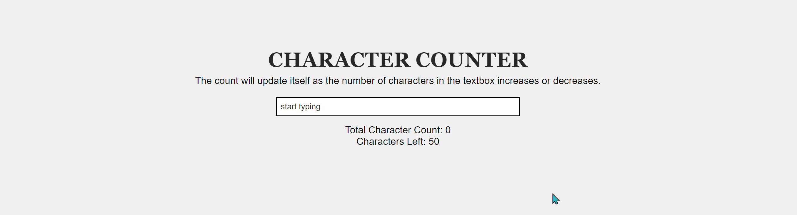

### General info

A live character counter that will update itself as the number of characters in the textbox
increases or decreases. If the characters exceed the maximum length of 50, the count down number turns red in colour.

### To view

Link to project: https://juel07.github.io/character-counter/

### Demo

### Technologies

- HTML5
- CSS3
- JavaScript
